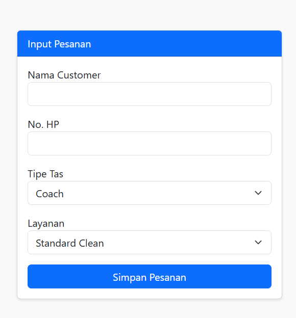
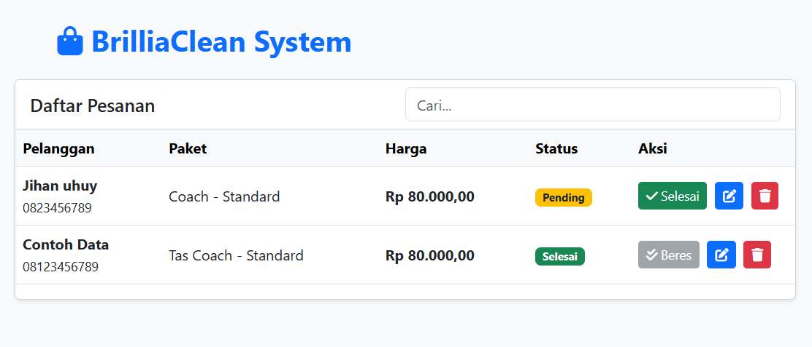

  <h1>BrilliaClean System</h1>
  

    <b>Sistem Manajemen Laundry Tas Branded Berbasis Web</b>
  

  
  

    
    
    
    
  

 

## 📋 About The Project

*BrilliaClean System* is a web-based application designed to manage orders for a premium bag laundry service. This project demonstrates a hybrid architecture where *PHP* handles the web interface and API, while *Python* is utilized as a backend logic engine for complex price calculations.

The database is robustly designed using *MySQL/MariaDB, implementing advanced features such as **Stored Procedures, Triggers, Functions, and Views* to ensure data integrity and business logic centralization.

### ✨ Key Features
* *CRUD Operations*: Create, Read, Update, and Delete orders seamlessly.
* *Hybrid Logic*: Price calculation is processed by a Python script integrated with PHP.
* *Live Search*: Real-time searching for customers or packages using JavaScript Fetch API.
* *Status Management*: Track order status (Pending / Selesai) with visual indicators.
* *Database Automation*:
    * *Stored Procedures*: For secure data insertion and updates.
    * *Triggers*: Automatic logging of deleted orders.
    * *Functions*: Custom logic for discount calculations directly in the DB.
    * *Views*: Simplified data presentation for the frontend.

## 🛠 Tech Stack

* *Frontend*: HTML5, JavaScript (Vanilla), Bootstrap 5 (UI Framework).
* *Backend*: Native PHP (API & Controller).
* *Computational Logic*: Python 3.x.
* *Database*: MySQL / MariaDB.

## 📂 Folder Structure

text
htdocs/tas_pro/
├── api.php           # Backend Logic (PHP handles requests)
├── calc.py           # Python Script for Price Calculation
├── config_db.php     # Database Connection
├── index.html        # Main User Interface
├── img/              # Images & Assets
│   └── logo.png
└── js/
    └── app.js        # Frontend Logic (Fetch API & DOM Manipulation)
`

## 🚀 Getting Started

Follow these steps to set up the project locally on your machine.

### Prerequisites

  * *XAMPP* (Apache & MySQL).
  * *Python 3.x* installed and added to system PATH.

### Installation

1.  *Clone the Repository*

    bash
    git clone [https://github.com/username-kamu/brilliaclean-system.git](https://github.com/username-kamu/brilliaclean-system.git)
    

2.  *Move Project Folder*
    Move the folder to your XAMPP directory: C:\xampp\htdocs\tas_pro.

3.  *Setup Database*

      * Open *phpMyAdmin*.
      * Create a database named db_tas.
      * Import the SQL file provided in database/db_tas_full.sql (or copy the SQL query from the documentation).

4.  *Run the Application*
    Open your browser and navigate to:

    
    http://localhost/tas_pro/index.html
    

## 📸 Screenshots

(Optional: Add screenshots of your application here)

| Input Form | List & Status |
|:---:|:---:|
| \ | \ |

## 🐛 Troubleshooting

*Issue:* Warning: shell_exec() has been disabled

  * *Fix:* Open php.ini in XAMPP, search for disable_functions, and remove shell_exec from the list. Restart Apache.

*Issue:* Python calculation not working.

  * *Fix:* Ensure Python is installed and try running python --version in your CMD. If PHP cannot find Python, edit api.php and use the full path (e.g., C:\Python39\python.exe).

## 👨‍💻 Author

*JIHAN SALMA SALSABILA*

  * Mahasiswa D4 Manajemen Informatika
  * Universitas Negeri Surabaya
